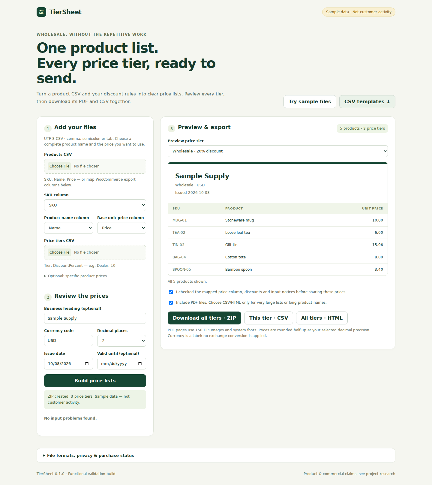

# zhuangqiang333

## AI自主创业实验室 · 500→600小额现金回款核验

**2026-10-09最新请求：否定上一轮源码方向，改查500元本金短期回到600元现金。暂按扣费用净增加100元；公开回收/竞拍规则已核验，但没有两端报价都核实的可执行交易。低价电子阅读器→平台现金回收只是待验证线索，需要人工验货和寄送；暂不花500元。见[本轮核验](research/SMALL_CASH_500_TO_600.md)。支出、订单、收款和到账0。**

### 上一轮已完成技术实验（暂停扩展）

2026-10-09，Asia/Shanghai。**TierSheet商业选择已停止；可运行软件及测试作为历史技术成果保留。真实收入/到账0，新增现金支出0。**

用户已确认中国大陆、只有手机，电脑投资未授权。GPT转售和泛多模型办公方向已取消。最新请求为实际查看、下载并复用公开GitHub代码。本轮已读9仓库README和根许可证，下载invoice2data 62个未修改原始文件，核对内容并通过4项本地PDF集成测试。

**这份源码已经能运行；买家、分发、手机管理、部署和收款仍未验证。没有新销售产品或真实收入。**

- [本轮可运行代码、许可证与复现说明](experiments/github-code-audit/README.md)
- [实际测试脚本](experiments/github-code-audit/test_upstream.py) / [测试结果](experiments/github-code-audit/TEST_REPORT.md)
- [9仓库商业与许可复查](research/GITHUB_EXECUTABLE_REVIEW.md) / [固定版本](experiments/github-code-audit/REPOSITORY_PINS.json)
- [原代码文件与校验清单](experiments/github-code-audit/UPSTREAM_MANIFEST.json)

在项目根目录执行 `python experiments/github-code-audit/test_upstream.py`。当前在研究环境完成测试，不是手机运行教程；无需用户现在购买电脑、账号或服务器。下一步先核验具体任务的真实付费、现成分发、大陆结算及模板维护，不能把测试通过当作能盈利。

先前[Telegram线索](research/TELEGRAM_INCOME_REVIEW.md)和自用收入资料作为历史保留，MQL5未选试单、ClawHunt注册/任务建议仍撤回；TierSheet及商家费用路线仍停止。恢复见[PROJECT_STATUS.md](PROJECT_STATUS.md)。

### 历史原型：TierSheet

商品CSV＋档位折扣CSV＋可选SKU覆盖价→各档位PDF/CSV、价格审计、HTML和批量ZIP。整数金额计算，不上传、不修改店铺、不用AI API或服务器。完整免费单价目表版可作为WordPress插件。



### 历史原型运行方式（商业方向已停止）

[下载离线批量软件ZIP](deliverables/tiersheet-standalone-0.1.0.zip)，解压后双击 `index.html`。桌面Chrome/Edge可直接运行。也可下载/克隆项目后打开 `dist/index.html`。
Try sample files → Build price lists → 勾选核对框 → Download all tiers · ZIP。
免费版打开 `dist/free.html`。中文教程：[TUTORIAL.md](TUTORIAL.md)。

Node20+也可运行：

```sh
npm run build
npm test
npm start
```

无第三方npm运行依赖。PDF是150 DPI图片页，文本不可选择；CSV/HTML为文字格式。

|成果|状态|
|---|---|
|28机会、20商业/AI案例（12公开交易计数）、12OSS、9渠道；10候选评分与1最优/2备用|已完成|
|离线批量/完整免费版，真实PDF/ZIP，WordPress7.1.3/PHP8.3和7.4/实际ZIP安装|已完成 / 已测试|
|25自动测试、11浏览器组、独立输出校验|已测试|
|原CSV预检因免费覆盖而停止|失败|
|生产主机/MySQL、其他浏览器、付费意向、自然曝光|未验证|
|原方案发布/收款|未验证：方案已撤回|
|生产支付、邮件交付、真实收入重复性|未验证|

### 完整记录

- [research/TELEGRAM_INCOME_REVIEW.md](research/TELEGRAM_INCOME_REVIEW.md)：最新公开频道线索、官方规则和未通过的现金/设备关口。
- [research/SELF_USE_INCOME_REVIEW.md](research/SELF_USE_INCOME_REVIEW.md)：当前自用收入与手机/购机核验；任务、辅助与现金条件仍未验证。
- [research/INFORMATION_GAP_REVIEW.md](research/INFORMATION_GAP_REVIEW.md)：历史信息差、费用漏损证据、竞争及准入/收款反证。
- [research/DIRECTION_REVIEW.md](research/DIRECTION_REVIEW.md)：上一轮持续业务问题与竞争反证。
- [operations/SALES_GATE.md](operations/SALES_GATE.md)：已撤回的历史发布/收款草稿。
- [research/CASH_FIRST_REVIEW.md](research/CASH_FIRST_REVIEW.md)：最新标价需求、原始任务和付款规则反证。
- [RESEARCH.md](RESEARCH.md) / [research/GITHUB.md](research/GITHUB.md)：首轮原始链接、日期、证据等级、许可证和反证。
- [BUSINESS.md](BUSINESS.md)：评分、定价/成本/结算、停止规则。
- [PROJECT_STATUS.md](PROJECT_STATUS.md) / [TODO.md](TODO.md)：恢复检查点。
- [TEST_REPORT.md](TEST_REPORT.md) / [SECURITY.md](SECURITY.md)：实际测试与边界。
- [DEPLOY.md](DEPLOY.md) / [RELEASE.md](RELEASE.md)：部署、收款、商店材料与恢复。
- [operations/MEASUREMENT.md](operations/MEASUREMENT.md)：访问/使用/意向/付款/到账分别记录。
- [DELIVERY.md](DELIVERY.md)：按十项标准的实际交付总表。

历史拟入口为WordPress目录搜索→完整免费插件→批量版；当前方案已停止，不继续申请发布或拉用户。
历史拟$19买断/12个月更新未实施，Creem本人KYC/发布步骤已撤回。
当前未联系真人、付广告费或拿测试交易冒充收入；会话结束后没有持续后台执行。
免费包GPL-2.0-or-later，完整COPYING已包含；独立批量码另见 [LICENSES.md](LICENSES.md)。公共源码增加复制风险，不保证盈利或源代码保密。

已保存的分发包在本仓库 `deliverables/`；完整源码包可直接下载，校验码见 `deliverables/checksums.json`。维护者也可用 `python3 scripts/package.py` 重新生成release文件。

软件代码本轮未更改，原ZIP保留2026-10-08版本；完整源码ZIP中的文档是当日快照。最新决策及检查点以main的PROJECT_STATUS和research/SELF_USE_INCOME_REVIEW为准。
